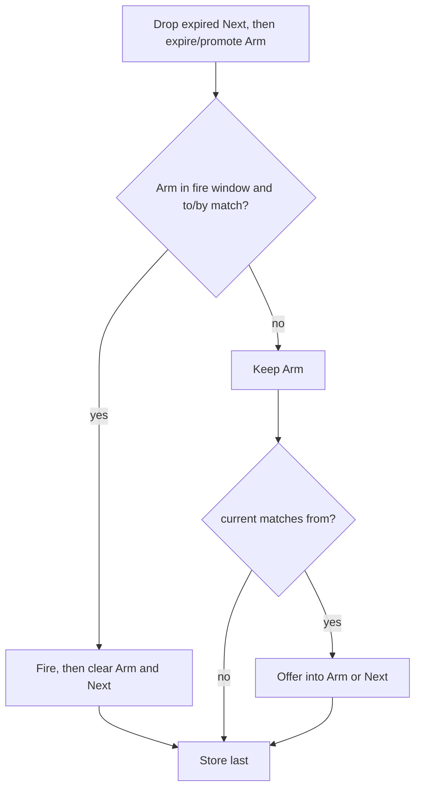

<!-- Copyright © 2026 DevAM. All rights reserved. Licensed under MIT license. See license in the repository root for license information. -->

# NetworkInspector Filter — Language & Behavior (by examples)

This document is the **example-driven specification** of the v1 filter language and runtime
behavior, and the single source of truth for it. It was promoted here from the drafting copy under
`plans/`, which now only points at this file.
Implementation plan: [`../plans/plans_filter-migration-modernization.md`](../plans/plans_filter-migration-modernization.md).

**Audience:** users writing filter expressions; implementers locking semantics.

**Not in v1:** `seq`, `stream`, `window`, `let`, `where`, public `nav(…)`, children/parent/siblings, relative short names in scopes, bytecode VM, AOT, MCP completer UI. Filters do not read `ValueCache` (values still come from the field tree).

---

## 1. Mental model

```mermaid
TD
  S[Filter expression + IStack]
  C[Compile: lex parse bind IDs JIT]
  P[Optional TryParse for UI spans only]
  I[PacketIndex presence prune]
  E[JIT eval per packet using IDs only]
  M[Match cache on filter]
  D[TryDerive new stack]
  S --> C --> I --> E --> M
  P -.-> C
  M --> D
  D --> C
```

| Idea | Meaning |
|------|---------|
| Stack at compile | **Public** `Compile(expr, stack)` binds names and JIT in one step. No separate `Resolve` |
| Unknown name = error | Field/protocol/alias unknown on that stack → **compile error** (not a silent non-match) |
| IDs in the hot path | Successful compile → JIT/eval uses `FieldId` / `ProtocolId` / `IndexGroupId` / `FieldAliasGroupId` only |
| TryParse (optional) | Syntax/UI spans **without** a stack — does **not** produce a matchable filter |
| Empty filter | Valid; `AlwaysMatch`; stack optional/ignored |
| Index first | Presence bitmaps avoid FieldTree work when possible |
| One tree walk | If values are needed, gather them in a single pass within the active domain |
| Scope `$Name[i?] { F }` | BFS-find anchor `Name`, evaluate full filter `F` only under that **subtree**; optional **`[i]`** for the i-th BFS hit |
| `flank` | Stateful edge detect: pairwise arrival/departure/`changed`/`by:`, plus **armed** `from:`+`to:`/`by:` (oldest in-window Arm + Next); O(1) two-slot state |
| Field names in scope | Always **qualified** (`udp.port`); no relative short names; search limited to current subtree |
| Cache | After first ascending eval of packet *N*, later queries for *N* are O(1) |
| Poison | Eval context error (e.g. regex timeout) → sticky fail until `ResetState` / `TryDerive`; unexpected JIT throws poison only when stateful |
| Derive | New stack → new filter from same `Expression` (re-bind + re-JIT; skip re-lex when AST retained) |

### 1.1 Public API: one compile step (no public Resolve)

| API | Needs `IStack`? | Result |
|-----|-----------------|--------|
| `Filter.Compile(expr, stack[, options])` | **Yes** (except empty → `AlwaysMatch`) | Matchable filter, or error (syntax **or** unknown name) |
| `Filter.TryParse(expr[, options])` | No | Syntax/spans only — **not** for `TryIsMatch` |
| `filter.TryDerive(newStack)` | Yes | New matchable instance; source unchanged |
| `TryIsMatch` | — | Ready after successful Compile/Derive |

```csharp
FilterResult<Filter> compiled = Filter.Compile("udp.port == 53", stack);
if (!compiled.TryGetValue(out Filter? filter))
{
    // syntax error OR unknown field/protocol/alias on this stack
}

// Hot path: FieldId slots only — no Resolve call
filter.TryIsMatch(packet, session.PacketIndex, out bool matched, out FilterError? err);
```

```text
# Stack without field/protocol "ab"
Filter.Compile("ab == 1", stackWithoutAb)
→ FilterError: unknown field or protocol 'ab'
```

```csharp
// UI while typing — no stack yet
Filter.TryParse("tcp.por == ", new FilterCompileOptions { OnFieldNameSpan = ... });
// Do NOT call TryIsMatch on a parse-only result
```

**CLI / Session:** build (or reuse) the session stack, then `Compile(expr, stack)`. Empty/`AlwaysMatch` needs no field binding. CLI command implementations: `NetworkInspector.CLI.Core`.

**Internal note:** lex → bind → JIT may still be separate phases inside `Compile`; they are **not** separate public steps.

---

## 2. Empty filter

| Expression | Compiles? | Behavior |
|------------|-----------|----------|
| `""` | yes → `AlwaysMatch` | Always true; **no** field access, **no** index work |
| `"   "` | yes → `AlwaysMatch` | Same |
| omitted CLI `--filter` | — | Convert/Export: **do not parse** packets (frame path) |
| `--filter ""` | AlwaysMatch | Same as omitted: **do not parse** |

```text
# CLI — equivalent “copy all frames, no protocol stack”
ni convert in.pcap -o out.pcapng
ni convert in.pcap -o out.pcapng --filter ""
ni convert in.pcap -o out.pcapng --filter "   "
```

```csharp
FilterResult<Filter> r = Filter.Compile(""); // empty/whitespace → AlwaysMatch; no stack required
// r success, r.Value.IsAlwaysMatch == true
```

Non-empty expressions use `Filter.Compile(expr, stack[, options])`.

---

## 3. Classic filters (Wireshark-like core)

### 3.1 Protocol presence

```text
tcp
udp
!tcp
tcp && udp          # unusual but valid: both present
tcp || udp
```

**Cost:** PacketIndex protocol bitmap only — **no** FieldTree iteration.

### 3.2 Field comparisons

```text
udp.port == 53
udp.srcport == 53
tcp.dstport != 443
frame.len > 100
ip.ttl >= 64
```

**Cost:** index group prune (candidates) → one FieldTree gather for required fields → compare. Materialize lazy fields only on miss.

### 3.3 Boolean composition

```text
ip.src == 10.0.0.1 && tcp.dstport == 443
(udp.srcport >= 50000 && udp.dstport <= 80) || eth.src == 66:77:88:99:aa:bb
tcp && tcp.port == 80
```

`A && B`: if `A` is false, `B` is not evaluated (short-circuit). Index dependencies use AND intersection when both sides are prunable.

### 3.4 Sets and ranges

```text
tcp.port in {80, 443, 8080}
tcp.port in 1024..65535
```

### 3.5 Strings

```text
http.host contains "foo"
http.host matches ".*\\.example\\.com"
```

### 3.6 Slice and length

```text
eth.src[0:3] == 00:11:22
len(udp.payload) > 0
```

### 3.7 Multi-occurrence fields (same `FieldId`)

When the **same** `FieldId` appears more than once in one packet (QinQ `vlan.id`, repeated options, …), classic equality uses **any-occurrence** match semantics (Wireshark-like): the packet matches if **any** occurrence equals the right-hand side.

```text
vlan.id == 100
```

To target a **specific** occurrence of a container, use scope `$Name[i] { … }` (see §6) — classic compares do not take `#layer` sugar in v1.

### 3.8 Field aliases (`FieldAliasGroup`)

Aliases are **metadata on the stack**, not nodes in the parse tree. Example: `eth.addr` → members `{ eth.dst, eth.src }`.

| Rule | Behavior |
|------|----------|
| Bind at compile | `IStack.GetFieldAliasGroupId(name)` — **not** `GetFieldId` (alias names never return a `FieldId`) |
| Compare `alias == X` | **Any-member, any-occurrence**: match if any member field’s any tree occurrence equals `X` |
| Presence `eth.addr` | True if any member is present (index: union of members’ groups when prunable) |
| Unknown alias | Compile error (same as unknown field) |
| JIT | Closed over `FieldAliasGroupId` + member `FieldId[]` from the stack at compile time |

```text
eth.addr == aa:bb:cc:dd:ee:ff
# ≡ eth.dst == aa:bb:cc:dd:ee:ff || eth.src == aa:bb:cc:dd:ee:ff
# (including multi-occurrence any-match on each member)
```

```text
# Not an alias — must be a real field or protocol on the stack
eth.nope == 1   → compile error
```

---

## 4. What is *not* supported (v1)

These must **fail at compile/parse** with a clear error (no silent ignore):

```text
# Removed aggregations / sequences
seq(step syn: tcp.flags == 0x02, step ack: tcp.flags == 0x10, within: 5s)
stream(tcp.stream).count() > 100
window(1s).count() > 1000

# Removed bindings (shadowing / ambiguity with field names)
let p = tcp.port;
where p == 80
```

**Reuse without `let`:**

```text
# Repeat the path
tcp.port == 80 || tcp.port == 443

# Or scope under a subtree (qualified names inside)
$tcp { tcp.port == 80 || tcp.port == 443 }
```

---

## 5. `flank` — edge detection (stateful)

Notation used in every sequence below:

```text
F:    the expression
Seq:  one sample per packet (consecutive PacketIds unless noted)
Res:  · = no match on that packet, ✓ = match
```

### 5.1 Syntax

```text
flank(<field>
      [, from: <endpoint>]
      [, to:   <endpoint>]
      [, by:   <delta-expr>]
      [, changed]
      , within: <window>
      [, when: <classic>])

<endpoint>     ::= <literal> | <cmp> <literal>
<delta-expr>   ::= <signed-integer> | <cmp> <signed-integer>
<signed-integer> ::= ['-'] <integer>
<cmp>          ::= == | != | < | <= | > | >=
<window>       ::= <duration> | <N>packets     # e.g. 5s, 100ms, 10packets
```

`by` is a named argument like `from` / `to`, not a keyword. Bare `by: 2` means delta `== 2`.

Rules:

- `within:` is **required**.
- Combining `changed` with `from:` / `to:` / `by:` → compile error.
- `by:` with `to:` requires `from:`.
- `by:` is only legal on integer fields (signed or unsigned 64-bit). Float, bool, string, and address fields fail at compile.
- `by:` literals must be integers (`by: 1.5` / `by: "x"` → compile error).
- Duplicate `from:` / `to:` / `by:`: last wins.
- `when:` optional gate: if false, or if the field is missing, the packet is invisible — the tracker is neither read nor updated. PacketIds and timestamps of invisible packets still exist, so a later visible sample can expire an arm across the gap.

### 5.2 Two mode families

**Armed** = `from:` is present **and** (`to:` is present **or** `by:` is present).
**Pairwise** = everything else (`changed`, empty endpoints, `to:`-only arrival, `from:`-only departure, `by:`-only).

`from:` alone stays pairwise departure. Armed mode is the latch: intermediates that match neither start nor end do **not** cancel the start.

| Mode | How to write | Match when |
|------|--------------|------------|
| Armed endpoints | `from: A, to: B` | oldest in-window `from` sample, then a later `to` sample |
| Armed delta | `from: A, by: ≥ N` | oldest in-window `from`, then `current − arm` satisfies `by:` |
| Armed both | `from:` + `to:` + `by:` | `to` **and** delta must hold; if `to` matches but `by` fails, stay armed |
| Arrival | `to: B` only | previous sample is **not** in `to`; current **is** |
| Departure | `from: A` only | previous sample **is** in `from`; current **is not** |
| Pairwise delta | `by:` only | adjacent stored sample, `current − last` satisfies `by:` |
| Any change | `changed`, or no from/to/by | previous sample exists and `current != last` |

There is **no** implicit `delta != 0`. `by: <= 2` fires on a zero jump; write `by: > 0` / `by: >= 2` when a real change is required.

### 5.3 Window: keep vs fire

`within:` is a proximity check, not a ring buffer. Packet distance is `nowId − refId`. Time distance is `nowNanos − refNanos`.

| Check | Packet window | Time window |
|-------|---------------|-------------|
| Too old (promote / drop) | `elapsed > PacketCount` | `elapsed > duration` |
| Can fire | `0 ≤ elapsed ≤ PacketCount` | `0 ≤ elapsed ≤ duration` |
| Future ref (`elapsed < 0`) | keep the candidate, do **not** fire | same — merged captures can run clocks backwards |

| `within` | Arm at id 0 still valid at id | First expired id |
|----------|-------------------------------|------------------|
| `1packet` | 0, 1 | 2 |
| `2packets` | 0, 1, 2 | 3 |

PacketIds must still be presented in **ascending** order (out-of-order eval poisons the filter). Timestamps may go backwards.

### 5.4 Armed latch: Arm + Next

Armed mode keeps **two** `from:` candidates:

| Slot | Role |
|------|------|
| **Arm** | Oldest `from` still inside `within:`. Fire and `by:` use this sample. |
| **Next** | Second-oldest `from`. Unused for fire until Arm is too old. |

Arm is **never** refreshed to a later `from` while it is still valid. After a fire, **both** slots clear — `from:` must be seen **on a later packet**. The firing packet is not offered, even when it still matches `from:`. v1 stores exactly two candidates (not a history deque). A third `from` while both slots are full may be dropped (packet windows) or compete by timestamp (time windows); see H3.

Overlapping `from:` / `to:` (example `from: < 10, to: >= 5`) and armed `by:` that includes `0` (example `from: 0, by: <= 2`) therefore fire at most every other visible sample while the value stays in `from:`. Stay-in-region is not “one edge then silence”; that would need the pairwise arrival guard, which armed mode must not use (C8b).

Per gated (visible) sample:

1. If Next exists and is too old, drop it. Then while Arm is too old: promote Next, or disarm if Next is empty.
2. Fire if Arm exists, the fire-window holds, and `to:` / `by:` succeed. Do **not** require “previous packet was outside `to:`” — that pairwise arrival guard would skip a later `to` after a near-miss (C8b).
3. If fire → clear Arm **and** Next. Do not Offer on this packet.
4. Else if current matches `from:` → Offer into Arm / Next.
   A packet that just armed (empty → Arm this step) never fired in step 2.
5. Store current as last (pairwise modes use last; armed fire uses Arm).



Packet-window offer: fill empty Arm, else empty Next, else ignore (later ids cannot be older). After a promote on this packet, do not refill Next from the current sample — that third `from:` stays dropped (H3). Time-window offer: keep the two **smallest timestamps**, including after a promote; a later PacketId with an earlier clock can become Arm.

### 5.5 Armed `from:` + `to:` (A)

#### A1 — Cross-intermediate

```text
F: flank(ip.ttl, from: 1, to: 2, within: 10packets)
Seq: 1, 3, 3, 2
Res: ·, ·, ·, ✓
# arm at 1; 3s are noise; fire on the first 2
```

| PacketId | Value | Expire | Fire | Arm after |
|----------|-------|--------|------|-----------|
| 0 | 1 | — | no | ARM @0 |
| 1 | 3 | no | no | stays |
| 2 | 3 | no | no | stays |
| 3 | 2 | no | yes | DISARM |

#### A2 — Re-arm after fire

```text
F: flank(ip.ttl, from: 1, to: 2, within: 10packets)
Seq: 1, 1, 2, 1, 2
Res: ·, ·, ✓, ·, ✓
```

| PacketId | Value | Expire | Fire | Arm after |
|----------|-------|--------|------|-----------|
| 0 | 1 | — | no | ARM @0 |
| 1 | 1 | no | no | ARM @0, Next @1 |
| 2 | 2 | no | yes | DISARM (both cleared) |
| 3 | 1 | — | no | ARM @3 |
| 4 | 2 | no | yes | DISARM |

#### A3 — No double-fire in `to`

```text
F: flank(ip.ttl, from: 1, to: 2, within: 10packets)
Seq: 1, 1, 2, 2
Res: ·, ·, ✓, ·
```

| PacketId | Value | Expire | Fire | Arm after |
|----------|-------|--------|------|-----------|
| 0 | 1 | — | no | ARM @0 |
| 1 | 1 | no | no | ARM @0, Next @1 |
| 2 | 2 | no | yes | DISARM (Next dropped too) |
| 3 | 2 | — | no | still disarmed |

#### A4 — Arm expires before `to`

```text
F: flank(ip.ttl, from: 1, to: 2, within: 2packets)
Seq: 1, 9, 9, 2
Res: ·, ·, ·, ·
# dist(0→3)=3 > 2 → expire; 2 is not from → no re-arm
```

#### A5 — Oldest expires, Next still in window (promote)

```text
F: flank(ip.ttl, from: 1, to: 2, within: 2packets)
Seq: 1, 1, 9, 2
Res: ·, ·, ·, ✓
# Arm@0 Next@1; id3: expire Arm@0, promote Next@1, dist(1→3)=2 ≤ 2, fire
```

#### A5b — Oldest arm still in window does fire

```text
F: flank(ip.ttl, from: 1, to: 2, within: 4packets)
Seq: 1, 1, 1, 2
Res: ·, ·, ·, ✓
# dist(0→3)=3 ≤ 4
```

#### A6 — Relational endpoints

```text
F: flank(ip.ttl, from: < 10, to: >= 10, within: 5s)
Seq: 8, 12, 15
Res: ·, ✓, ·
```

```text
F: flank(ip.ttl, from: > 100, to: <= 50, within: 1s)
Seq: 200, 150, 40
Res: ·, ·, ✓
```

#### A7 — `to` without prior `from`

```text
F: flank(ip.ttl, from: 1, to: 2, within: 10packets)
Seq: 3, 3, 2, 2
Res: ·, ·, ·, ·
```

#### A8 — Re-entry after leaving `to`

```text
F: flank(ip.ttl, from: 1, to: 2, within: 10packets)
Seq: 1, 2, 3, 1, 2
Res: ·, ✓, ·, ·, ✓
```

#### A9 — Conversation `1,3,2,3,2`

```text
F: flank(ip.ttl, from: 1, to: 2, within: 10packets)
Seq: 1, 3, 2, 3, 2
Res: ·, ·, ✓, ·, ·
```

| PacketId | Value | Expire | Fire | Arm after |
|----------|-------|--------|------|-----------|
| 0 | 1 | — | no | ARM @0 |
| 1 | 3 | no | no | stays |
| 2 | 2 | no | yes | DISARM |
| 3 | 3 | — | no | still disarmed (3 ≠ from) |
| 4 | 2 | — | no | still disarmed |

#### A10 — Breaking change vs old pairwise

```text
F: flank(ip.ttl, from: 64, to: 1, within: 1s)
Seq: 64, 2, 1
Old pairwise: ·, ·, ·     (last is 2, not 64)
New armed:    ·, ·, ✓
```

`64, 2, 64, 1` still ends `·, ·, ·, ✓` — the arm is the first 64, not the second.

### 5.6 Expiry + re-arm (B)

#### B1 — Packet-window expiry, no fire (delta)

```text
F: flank(ip.ttl, from: 1, by: >= 5, within: 2packets)
Seq: 1, 2, 3, 10
Res: ·, ·, ·, ·
# id1: 2-1=1 < 5; id2: 3-1=2 < 5; id3: dist=3>2 expire; 10 ≠ from
```

#### B2 — Re-arm after expiry, then fire

```text
F: flank(ip.ttl, from: 1, to: 2, within: 2packets)
Seq: 1, 9, 9, 1, 2
Res: ·, ·, ·, ·, ✓
# id3: expire arm@0, then 1 re-arms @3; id4: fire
```

#### B3 — Time-window expiry

```text
F: flank(ip.ttl, from: 0, to: >= 5, within: 100ms)
Seq: t=0ms val=0 · | t=50ms val=3 · | t=200ms val=8 ·
Res: ·, ·, ·
```

#### B4 — Expire on a `to` packet that is not `from`

```text
F: flank(ip.ttl, from: 1, to: 2, within: 1packet)
Seq: 1, 5, 2
Res: ·, ·, ·
# id2: dist(0→2)=2 > 1 expire; 2 ≠ from
```

### 5.7 Delta `by:` (C)

`delta = current − arm` (armed) or `current − last` (pairwise). Overflow, or a value that does not fit in a signed 64-bit integer, does not fire.

| Written | Fires when |
|---------|------------|
| `by: 2` / `by: == 2` | delta == 2 |
| `by: != 0` | delta != 0 |
| `by: > 0` | delta > 0 |
| `by: >= 2` | delta >= 2 |
| `by: < 5` | delta < 5 |
| `by: <= -3` | delta <= -3 |
| `by: -2` | delta == -2 |

#### C1 — Pairwise exact

```text
F: flank(ip.ttl, by: 2, within: 5packets)
Seq: 1, 3, 5, 7
Res: ·, ✓, ✓, ✓
```

#### C2 — Pairwise `>= 2`

```text
F: flank(ip.ttl, by: >= 2, within: 5packets)
Seq: 1, 2, 4, 5
Res: ·, ·, ✓, ·
```

#### C3 — Pairwise `<= -3`

```text
F: flank(ip.ttl, by: <= -3, within: 5packets)
Seq: 10, 8, 5, 4
Res: ·, ·, ✓, ·
```

#### C4 — Pairwise `!= 0`

```text
F: flank(ip.ttl, by: != 0, within: 1s)
Seq: 4, 4, 5, 5
Res: ·, ·, ✓, ·
```

#### C5 — Armed `from` + exact `by`

```text
F: flank(ip.ttl, from: 1, by: 2, within: 10packets)
Seq: 1, 3, 3, 2
Res: ·, ✓, ·, ·
# 3-1=2 fire+disarm; later 2 is not from
```

#### C6 — Armed `by: >= 2`

```text
F: flank(ip.ttl, from: 0, by: >= 2, within: 10packets)
Seq: 0, 1, 4, 10
Res: ·, ·, ✓, ·
```

#### C7 — Armed `>= 2` across intermediates

```text
F: flank(ip.ttl, from: 1, by: >= 2, within: 10packets)
Seq: 1, 2, 5
Res: ·, ·, ✓
```

#### C8 — Armed `from` + `to` + `by`

```text
F: flank(ip.ttl, from: 0, to: >= 10, by: >= 5, within: 5s)
Seq: 0, 3, 12
Res: ·, ·, ✓
```

#### C8b — `to` matches, `by` fails, stay armed

```text
F: flank(ip.ttl, from: 0, to: >= 10, by: >= 50, within: 5s)
Seq: 0, 12, 60
Res: ·, ·, ✓
# 12 is in to but 12-0 < 50; 60-0 >= 50
```

#### C9 — Armed delta expiry

```text
F: flank(ip.ttl, from: 0, by: >= 5, within: 2packets)
Seq: 0, 2, 3, 10
Res: ·, ·, ·, ·
```

#### C10 — Pairwise exact negative

```text
F: flank(ip.ttl, by: -2, within: 5packets)
Seq: 8, 6, 4
Res: ·, ✓, ✓
```

#### C11 — `by: <= 2` includes delta 0

```text
F: flank(ip.ttl, by: <= 2, within: 5packets)
Seq: 5, 5, 8
Res: ·, ✓, ·
# 5-5=0 ≤ 2; 8-5=3 > 2
```

#### C12 — Pairwise `by:` window (adjacent only)

```text
F: flank(ip.ttl, by: >= 2, within: 1packet)
Seq: 1, 5, 10
Res: ·, ✓, ✓
# both steps have distance 1 and delta ≥ 2
```

#### C13 — Pairwise `by:` window miss

```text
F: flank(ip.ttl, by: >= 2, within: 1packet)
Packets: id0 val=1, id2 val=5   (no id1)
Res: ·, ·
# distance 2 > 1
```

#### C14 — `by: > 0`

```text
F: flank(ip.ttl, by: > 0, within: 5packets)
Seq: 3, 3, 4
Res: ·, ·, ✓
```

```text
F: flank(ip.ttl, by: < 0, within: 5packets)
Seq: 4, 4, 3
Res: ·, ·, ✓
```

### 5.8 Unchanged pairwise modes (D)

#### D1 — Arrival already crosses intermediates

```text
F: flank(ip.ttl, to: 2, within: 10packets)
Seq: 1, 3, 3, 2
Res: ·, ·, ·, ✓
```

#### D2 — Arrival re-entry

```text
F: flank(ip.ttl, to: < 64, within: 1s)
Seq: 64, 63, 62, 64, 63
Res: ·, ✓, ·, ·, ✓
```

#### D3 — Departure

```text
F: flank(ip.ttl, from: 64, within: 1s)
Seq: 64, 63, 62, 64
Res: ·, ✓, ·, ·
```

#### D4 — Any change

```text
F: flank(ip.ttl, changed, within: 1s)
Seq: 64, 64, 63, 63, 62
Res: ·, ·, ✓, ·, ✓
```

Pairwise arrival still stores every sample, so it fires **once on entry** and again only after leaving and re-entering the region.

### 5.9 `when:` gate (E)

Invisible packets do not arm or update. Their PacketIds still count for `within: Npackets`.

#### E1 — Hidden packet does not arm/update; ids still count

```text
F: flank(ip.ttl, from: 1, to: 2, within: 10packets, when: udp.srcport == 53)
(ttl=1,port=53) ·  (ttl=9,port=99) invisible  (ttl=2,port=53) ✓
```

#### E2 — Gate delays arm

```text
F: flank(ip.ttl, from: 1, to: 2, within: 10packets, when: udp.srcport == 53)
(ttl=1,port=99) invisible  (ttl=1,port=53) ·  (ttl=2,port=53) ✓
# first visible 1 arms; next 2 fires
```

### 5.10 Realistic recipes (F)

```text
F: flank(ip.ttl, from: 0, by: >= 2, within: 500ms)
Seq: 0, 1, 3
Res: ·, ·, ✓

F: flank(ip.ttl, from: > 1, to: 1, within: 2s)
Seq: 64, 5, 1
Res: ·, ·, ✓

F: flank(tcp.window_size, from: 0, by: 1460, within: 1s, when: tcp)
Seq: 0, 0, 1460
Res: ·, ·, ✓

F: flank(ip.ttl, from: < 5, to: >= 20, by: >= 10, within: 5s)
Seq: 3, 8, 25
Res: ·, ·, ✓

F: flank(ip.ttl, by: <= -3, within: 20packets)
Seq: 10, 8, 5
Res: ·, ·, ✓

F: flank(ip.ttl, by: != 0, within: 100ms, when: ip)
Seq: 4, 4, 5
Res: ·, ·, ✓
```

Combine with classic terms as usual: `tcp && flank(tcp.flags, to: 0x10, within: 5s)`.

### 5.11 Breaking change (G)

Only `from:` **together with** `to:` and/or `by:` changed. Arrival, departure, and `changed` stay pairwise.

| Filter | Sequence | Old | New |
|--------|----------|-----|-----|
| `from:1, to:2` | `1,3,3,2` | `····` | `···✓` |
| `from:1, to:2` | `1,3,2,3,2` | `·····` | `··✓··` |
| `from:1, to:2` | `1,1,2,1,2` | `··✓·✓` | `··✓·✓` |
| `from:64, to:1` | `64,2,1` | `···` | `··✓` |
| `from:64, to:1` | `64,2,64,1` | `···✓` | `···✓` |

### 5.12 Next-promote and non-monotonic time (H)

#### H1 — Promote Next when Arm expires (same as A5)

```text
F: flank(ip.ttl, from: 1, to: 2, within: 2packets)
Seq: 1, 1, 9, 2
Res: ·, ·, ·, ✓
```

#### H2 — Fire clears Next (no double-hit)

```text
F: flank(ip.ttl, from: 1, to: 2, within: 10packets)
Seq: 1, 1, 2, 2
Res: ·, ·, ✓, ·
# id1 was Next; fire at id2 drops Next; id3 must not re-fire
```

#### H3 — Two-slot limit (third `from` dropped)

```text
F: flank(ip.ttl, from: 1, to: 2, within: 2packets)
Seq: 1, 1, 1, 1, 2
Res: ·, ·, ·, ·, ·
# Arm@0 Next@1; id2/id3 ignored; after promote Next@1 also expired
```

#### H4 — Time window, later PacketId with earlier timestamp

```text
F: flank(ip.ttl, from: 1, to: 2, within: 10s)
# ids increase; clocks do not
# id0 t=100s val=1 → Arm t=100
# id1 t=50s  val=1 → Offer: Arm t=50, Next t=100
# id2 t=105s val=2 → Arm t=50 is too old (55s > 10s) → promote Next t=100
#                    fire window (5s) → ✓
Res: ·, ·, ✓
```

#### H5 — Backwards timestamp does not fire, but does not drop Arm

```text
F: flank(ip.ttl, from: 1, to: 2, within: 10s)
# id0 t=100s val=1 Arm
# id1 t=90s  val=2  elapsed(Arm)=−10s → no fire (keep Arm); 2 is to → ·
# id2 t=105s val=2  elapsed=5s → ✓
Res: ·, ·, ✓
```

### 5.13 Evaluation order contract

```text
Packets must be presented in ascending PacketId for flank correctness.
```

```csharp
filter.TryIsMatch(p0, ...);
filter.TryIsMatch(p1, ...);
filter.TryIsMatch(p0, ...); // re-query: match cache

old.TryDerive(newStack, out Filter? neu, out FilterError? err);
```

---

## 6. Scope — `$Name[i?] { Filter }` (subtree find)

### 6.1 Purpose

1. Restrict evaluation to a **subtree** under a named anchor (protocol or field node) so other branches are not walked / not materialized.
2. Nest full filters inside scopes (same language, recursively).
3. Disambiguate multiple occurrences (tunneling, QinQ) with **`$Name[i]`** (square brackets, 0-based BFS index).
4. Keep the surface **small**: no `children` / `parent` / `siblings` / `nav(…).filter` user API in v1.

### 6.2 Syntax (locked)

```text
scope-expr ::= '$' Name [ '[' index ']' ] '{' Filter '}'

Name       ::= protocol or field name bound on the compile-time stack
index      ::= non-negative integer          # 0-based in BFS discovery order
Filter     ::= full filter expression        # classic, flank, and nested $scope…
```

| Form | Meaning |
|------|---------|
| `$Name { F }` | From the **current domain**, **BFS**-find all nodes named `Name`; `F` must hold under **at least one** such subtree (existential) |
| `$Name[i] { F }` | Same find, but keep only the **i-th** BFS hit (0-based); if fewer than `i+1` hits → **false** |
| Nested `$…{…}` inside `F` | Find starts from that **subtree root** (not the packet root again) |

**Brackets (`[i]`) — locked details:**

| Rule | Behavior |
|------|----------|
| Optional | Omit `[i]` → existential over all BFS hits |
| Index base | **0-based** (`$udp[0]` = first BFS hit) |
| Order | Hits numbered in **BFS** discovery order (shallow before deep) |
| Missing hit | `$Name[i]` with too few hits → **false** (not a compile/runtime error) |
| Whitespace | `$udp[0]{…}`, `$udp[0] { … }`, `$udp [0] { … }` — allow spaces around `[` / `]` / `{` as usual in the language; prefer `$Name[i] { F }` in docs |
| Negative / non-int | Parse/compile error |
| Not sugar for slice | `eth.src[0:3]` remains classic byte-slice; scope brackets are **only** after `$Name` |

**Not in v1 (rejected):**

```text
^udp { … }                 # no caret
$udp.$first / $children    # no op chains
nav(udp).filter(…)         # no public verbose nav API
port == 53                 # inside scope — no relative short names
$udp.first { … }           # bare "first" is a field name, not an op
$udp[#1] / $udp[first]     # brackets take a non-negative integer only
```

### 6.3 Domain and BFS find

- **Top-level** expression: current domain = entire packet (search from packet root).
- Inside `$Name { … }`: current domain = the matched anchor’s **subtree** (anchor + all descendants).
- `$Name` locates nodes whose stack identity is `Name` (`ProtocolId` / `FieldId` / alias member set) via **BFS** (level order: shallow before deep).
- Default without `[i]`: try each hit until `F` succeeds (**existential**).
- With `[i]`: only the i-th hit in BFS order is a cursor; missing → false (not an error).

BFS implies: a top-level `udp` is typically found **before** a tunneled deep `udp`. Prefer `$udp[0]` when “first shallow match” must be explicit.

### 6.4 Field names inside a scope — always qualified

Relative names like `port` under `$udp` are **not** supported: fields are not guaranteed to share a protocol prefix, and the subtree may still be large.

Inside `{ F }`, every field/protocol reference uses the **same qualified names** as at top level (`udp.port`, `someip.messageid`, …). Evaluation **searches only within the current domain** (the scoped subtree).

```text
# CORRECT
$udp { udp.port == 53 }

# REJECT / not v1
$udp { port == 53 }
```

Aliases work as usual inside the domain (`eth.addr == …` → any member under that subtree).

### 6.5 Semantics of the block

`$Name { F }` is true iff:

1. At least one BFS hit for `Name` exists in the current domain (or the selected `[i]` exists), and  
2. `F` evaluates to true with domain = that hit’s subtree.

`$Name { F }` does **not** mean “only direct children of `Name`” — it means the **entire subtree** under the anchor. That is enough for materialization control (other packet branches are not entered) without a `children()` API.

### 6.6 Examples

```text
# Primary use case: find udp (BFS), evaluate only under that subtree
$udp { udp.port == 53 }

# First BFS hit only (often the shallow / top-level udp)
$udp[0] { udp.port == 53 }

# Second vlan container (e.g. inner QinQ)
$vlan[0] { vlan.id == 100 }
$vlan[1] { vlan.id == 200 }

# SOME/IP: XY only under someip when messageid matches
$someip {
  someip.messageid == 0x1234
  && someip.method_id == 1
}

# Nested scope: from someip subtree, BFS-find a deeper named node
$someip {
  someip.messageid == 0x1234
  && $sd { someip.sd.entries_length > 0 }
}

# Combine with classic outside
tcp && $udp { udp.port == 53 }

# Flank still allowed inside or outside scope
$tcp {
  tcp.port == 80
  && flank(tcp.flags, from: 0x02, to: 0x10, within: 5s)
}
```

### 6.7 Materialization and walk stack

| Rule | Behavior |
|------|----------|
| Domain restrict | Walk / field gather only under the active cursor subtree |
| Lazy | Prefer `materialize: false` until a value compare needs data |
| Allocations | **No** per-`TryIsMatch` stack allocation — reusable BFS queue / walk buffer on the **filter instance** (single-threaded) |

### 6.8 What this deliberately does *not* cover

| Need | v1 answer |
|------|-----------|
| Parent / sibling navigation | **Out** — restructure as nested `$` + qualified fields if possible |
| “Direct children only” (not grandchildren) | **Out** — subtree scope only |
| DFS find order | **Out** — BFS only for `$Name` |
| Relative short field names | **Out** — qualified names only |

### 6.9 Quick reference

| Question | Answer |
|----------|--------|
| How do I scope under udp? | `$udp { udp.port == 53 }` |
| First / n-th occurrence? | `$udp[0] { … }` / `$udp[1] { … }` (square brackets, 0-based BFS) |
| Missing `$udp[5]`? | **false** (not an error) |
| Top-level vs tunnel? | Prefer `$udp[0]` (BFS hits shallow first) or accept existential `$udp { … }` |
| Relative `port`? | No — use `udp.port` |
| children/parent/siblings? | Not in v1 |
| `$udp[0:1]`? | No — brackets take a single index, not a range |

---
## 7. Index vs FieldTree vs materialize

| Example | Index | FieldTree | Materialize |
|---------|-------|-----------|-------------|
| `tcp` | yes | no | no |
| `udp.port == 53` | group prune | one batch gather | only lazy miss |
| `tcp && udp.port == 53` | AND prune | gather only if tcp candidates | as needed |
| `!tcp` | often no prune | depends on rest | — |
| `AlwaysMatch` / `""` | no | no | no |
| `$udp { udp.port == 53 }` | udp prune if possible | **BFS find + scoped subtree** only | per touched lazy node |
| `$udp[0] { udp.port == 53 }` | udp prune | stop after first BFS udp + scoped pred | as needed |
| `$someip { someip.messageid == Z && … }` | someip prune | scoped under each/any someip hit | as needed |
| `eth.addr == X` (alias) | union of member groups | gather member FieldIds | as needed |


**Filters do not read `ValueCache`.** Presence index only. If a value is required, read it from the packet field tree (lazily).

---

## 8. Runtime API behavior (by example)

### 8.1 Compile / match (stack required for non-empty)

```csharp
FilterResult<Filter> compiled = Filter.Compile("udp.port == 53", stack);
if (!compiled.TryGetValue(out Filter? filter))
{
    // syntax error OR unknown field/protocol/alias on this stack
}

// Filter is immediately matchable — FieldId / ProtocolId / IndexGroupId / FieldAliasGroupId slots bound.
if (!filter.TryIsMatch(packet, session.PacketIndex, out bool matched, out FilterError? err))
{
    // err set; filter.IsPoisoned → sticky for later packets until ResetState / TryDerive
}
```

```csharp
// Unknown field on this stack — fail at Compile, never “always false” at eval
Filter.Compile("ab == 1", stack); // FilterError: unknown 'ab'
```

```csharp
// UI spans without stack (not matchable)
Filter.TryParse("tcp.por == ", options);
```

### 8.2 Match cache (evaluated + result)

After the first successful eval of packet id `N`, a later `TryIsMatch` for `N` must **not** re-run the JIT body.

Important: cache must distinguish:

| State | Meaning |
|-------|---------|
| Not yet evaluated | Must run JIT (first time in ascending pass) |
| Evaluated, matched | Return true |
| Evaluated, not matched | Return false **without** re-eval |

A single “match bit” that defaults to false is **not** enough (would re-eval all non-matches).

### 8.3 Poison

```csharp
// Packet 5: runtime fault (e.g. regex timeout) → poison — classic and flank filters alike
filter.TryIsMatch(p5, index, out _, out FilterError? e1); // false, e1 set, IsPoisoned

// Packet 6 and all later calls on this instance
filter.TryIsMatch(p6, index, out _, out FilterError? e2); // false, e2 == sticky e1

filter.ResetState(); // same stack: clears poison + cache + flank
// or
filter.TryDerive(newStack, out Filter? fresh, out _); // new instance, not poisoned
```

**Rules**

| Fault | Classic (stateless) | Flank (stateful) |
|-------|---------------------|------------------|
| `context.Error` (regex timeout, …) | Sticky poison | Sticky poison |
| Unexpected exception from JIT root | Propagates (no poison); eval context unbound | Sticky poison |
| Out-of-order packet id | N/A | Sticky poison |

Sticky poison keeps Sessions/CLI fail-closed: once a filter cannot decide, later packets must not silently pass or drop.

### 8.4 Derive for new stack

```csharp
// Session.Restart replaced the protocol stack
if (!oldFilter.TryDerive(newStack, out Filter? rebound, out FilterError? err))
{
    // fail closed — do not keep old FieldId JIT
}
// rebound.Expression == oldFilter.Expression
// rebound has fresh cache, flank state, IsPoisoned == false
// oldFilter unchanged
```

`AlwaysMatch.TryDerive` → `AlwaysMatch`.

Internally Derive re-binds symbols + re-JITs (may skip lex/parse if AST retained). There is **no** public in-place rebind.

---

## 9. Sessions integration (by example)

### 9.1 Per-listener filter

```csharp
FilterResult<Filter> fr = Filter.Compile("tcp.port == 443", sessionStack);
session.TryAddListener(myListener, fr.Value, out ListenerInfo? info);
session.TryAddListener(otherListener, filter: null, out _); // no filter ≡ all packets

// Or let the session compile against its own stack:
session.TryAddListener(
    thirdListener,
    "tcp.port == 443",
    out ListenerInfo? thirdInfo,
    out FilterError? filterFailure); // false + filterFailure when the expression is bad
```

### 9.2 Notifications vs pull

```text
OnNewPackets(from, to)      →  always the raw id window of newly stored packets
TryReadPackets(..., All)      →  every packet in range
TryReadPackets(..., Matching) →  only packets matching this listener's filter
```

Filtering does **not** suppress notifications.

### 9.3 Pull buffer

```csharp
PacketRef[] buffer = new PacketRef[256];
bool read = session.TryReadPackets(
    listenerId,
    startId: fromIndex,
    destination: buffer,
    mode: PacketReadMode.Matching,
    out int count,
    out PacketIdLayout layout,
    out FilterError? failure);

// layout == Gapped when Matching skipped ids
// layout == Contiguous for All (ids startId, startId+1, ...) even if Packet is null (store hole)
```

The buffer is caller-owned; the session never allocates on this path. An unfiltered listener can
also use the plain `ReadPackets(startId, destination, out layout)` overload, which always reports
`Contiguous`.

`Matching` + `AlwaysMatch` ≡ `All` + `Contiguous` (same fast path).

Matching uses candidate bitmaps when available, then `TryIsMatch` (cache-aware). When the filter
refuses to produce a verdict the read returns `false` with `count == 0` and `failure` set: either
the filter is poisoned, a packet failed to evaluate, or the filter could not be re-bound after a
stack swap. `All` reads keep working in all three cases.

An unknown `listenerId` is a caller bug, not a filter failure, and throws
`SessionException(SessionErrorCode.ListenerNotFound)`.

### 9.4 Stack restart

```text
Session.Restart(...)
  → for each listener: TryDerive(newStack) → replace slot filter
                       (failure → slot filter dropped, Matching reads report it)
  → OnStackChanged
  → OnNewPackets from 0
```

The derived filter is a fresh instance: empty flank state, empty match cache, no poison.

---

## 10. CLI (Convert + Export)

Commands live in **`NetworkInspector.CLI.Core`**; the `ni` executable (`NetworkInspector.CLI`) is a thin host.

```text
# No filter / empty → frame copy, no protocol stack, no parse
ni convert in.pcap -o out.pcapng
ni convert in.pcap -o out.pcapng --filter ""

# Non-empty → build stack, parse, JIT filter, emit matches only
ni convert in.pcap -o out.pcapng --filter "udp.dstport == 53"
ni export in.pcap -o out.json --filter "tcp && tcp.port == 443"
```

A packet is judged before any output file is opened, so a filter that matches nothing leaves no
empty file or dataset directory behind. A filter that does not compile exits with the argument
error code; a filter that fails to evaluate aborts the run with the runtime error code rather than
writing a partially filtered output.

---

## 11. Compile-time UI hooks (no full completer yet)

Prefer `TryParse` when no stack is available yet (typing). With a stack, `Compile` may still invoke the same span callback before failing on unknown names.

```csharp
FilterCompileOptions options = new()
{
    CaretPosition = 7, // optional
    OnFieldNameSpan = (expr, start, length, kind) =>
    {
        // Called even when the expression is incomplete/invalid
        // e.g. "tcp.por" while typing
    },
};

Filter.TryParse("tcp.por == ", options);
// or, when stack exists:
Filter.Compile("tcp.por == ", stack, options); // may fail bind; spans still reported
```

Full `TryGetCompletions` / MCP tools: **later**.

---

## 12. Profiling scenario names (JIT only)

| Name | Intent |
|------|--------|
| `filter-simple` | Simple classic expr throughput |
| `filter-complex` | Multi-clause classic |
| `filter-indexed` | Lazy packets + PacketIndex prune path |

---

## 13. Quick “when do I use what?”

| Goal | Prefer |
|------|--------|
| “Has TCP?” | `tcp` |
| “DNS queries” | `udp.port == 53` |
| “HTTPS to host” | `tcp.dstport == 443 && http.host contains "x"` |
| “MAC is X (src or dst)” | `eth.addr == …` (alias) |
| “Under udp, only that subtree” | `$udp { udp.port == 53 }` |
| “First BFS udp (often shallow)” | `$udp[0] { udp.port == 53 }` |
| “Outer vs inner vlan” | `$vlan[0] { vlan.id == 100 }` / `$vlan[1] { vlan.id == 200 }` |
| “XY under someip if messageid == Z” | `$someip { someip.messageid == Z && <XY> }` |
| “Any value change” | `flank(field, within: …)` / `flank(field, changed, within: …)` |
| “Crossed above threshold” | `flank(field, to: >= X, within: …)` |
| “From C to ≥ D, ignoring noise” | `flank(field, from: C, to: >= D, within: …)` |
| “Edge on a field (exact, armed)” | `flank(field, from: A, to: B, within: …)` |
| “Jumped by at least N after baseline” | `flank(field, from: A, by: >= N, within: …)` |
| “Adjacent samples differ by N” | `flank(field, by: N, within: …)` |
| “No filtering” | `""` / omit `--filter` / `null` listener filter |
| “Reuse a name” | Repeat path or `$Name { … }` — **not** `let` |

---

## 14. Changelog vs Dev filter

| Dev | v1 main |
|-----|---------|
| VM + optional JIT projects | Single project, JIT only |
| `seq` / `stream` / `window` | Removed |
| `let` / `where` | Removed |
| Value-cache prune | Removed (presence index only) |
| Empty → error | Empty → `AlwaysMatch` |
| In-place rebind after stack change | `TryDerive` (new Compile against new stack) |
| Per-call stateful errors | Sticky **poison** |
| Stringly eval / weak stack binding | **`Compile(expr, stack)`**; hot path = **IDs**; unknown name = compile error |
| Flank equality only | Equality **+ any-change + relational endpoints** (`to: >= D`, …) |
| Verbose nav / children/parent/siblings | **`$Name[i?] { Filter }`** — BFS find + brace subtree scope; **`[i]`** for occurrence; qualified names only |
| Alias support | **Required**: `FieldAliasGroup` any-member match |
| MCP filter tools | Deferred |
