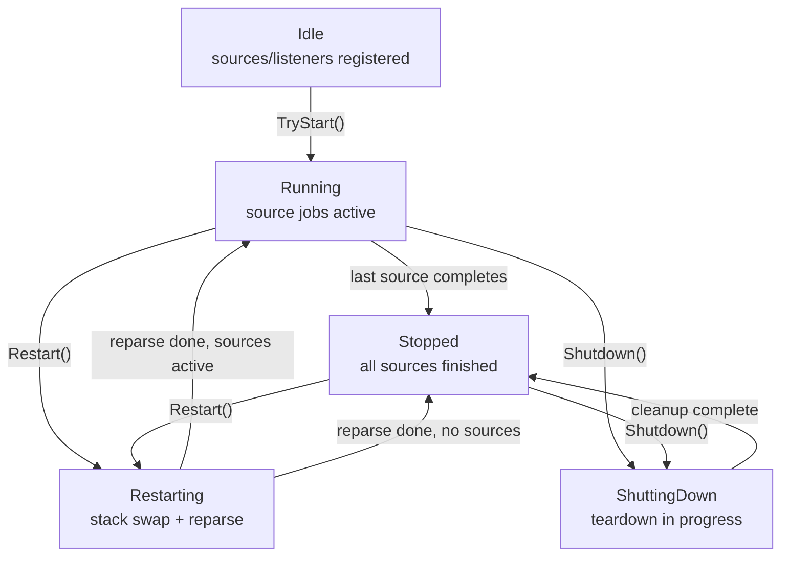

<!-- Copyright © 2026 DevAM. All rights reserved. Licensed under MIT license. See license in the repository root for license information. -->

# NetworkInspector.Sessions

[](https://www.nuget.org/packages/NetworkInspector.Sessions)

Session orchestration library for NetworkInspector.

## What This Is

`NetworkInspector.Sessions` coordinates frame sources, the protocol stack, pull-based listeners, and background jobs. It provides thread-safe packet access, a packet store with re-parse fallback, and Roaring-bitmap indexing during parsing.

Each frame source runs on a dedicated thread. Parsed packets are stored once in a shared `PacketStore`; listeners pull data on notification instead of receiving pushed copies.

## Lifecycle



Typical flow:

1. Create `Session` with a `Stack`.
2. `TryAddFrameSource` (Idle only) and `TryAddListener` (Idle, Running, or Restarting).
3. `TryStart()` — launches source and listener threads.
4. `WaitForCompletion()` — blocks until all source jobs finish.
5. `Shutdown()` or `Dispose()` — cancels listeners, disposes jobs and sources.

## Key Types

| Type | Role |
|------|------|
| `Session` | Lifecycle orchestration and shared stores |
| `ISession` | Mutable session API (`TryAddFrameSource`, `TryAddListener`, `TryStart`, `Restart`, `Shutdown`) |
| `ISessionReader` | Read-only view for listeners (`PacketCount`, `TryGetPacket`, `GetJobs`) |
| `ISessionListener` | Pull-based notification callbacks |
| `JobInfo` | Public view of a background job (source, listener, or user job) |
| `ListenerInfo` | Public view of a listener subscription |
| `ValueCacheRequest` | Name-based request for an ingest or runtime value cache |
| `IValueCacheListener` | Pull-based value-cache notifications (`OnNewRows`) |
| `ValueCacheInfo` | Public view of a value-cache subscription (`Cache` is a `ValueCacheReaderView`) |
| `FrameSourceInfo` | Public view of a registered frame source |
| `PacketStore` | Chunked store retaining all parsed packets until restart or shutdown |
| `PacketRef` | A `PacketId` paired with its packet, so a filtered pull can report gapped ids |
| `PacketReadMode` | `All` or `Matching` — whether a pull applies the listener's filter |
| `PacketIdLayout` | `Contiguous` or `Gapped` — whether returned ids are consecutive |
| `SessionException` | Typed errors with `SessionErrorCode` |

## Pull-Based Listeners

Producers set atomic `NotifyFlags` on each `ListenerSlot` and wake the listener thread via `ManualResetEventSlim`. The listener clears flags, then pulls data from `ISessionReader`:

| Flag | Callback |
|------|----------|
| `NewPackets` | `OnNewPackets(session, fromIndex, toIndexExclusive)` |
| `SourceAdded` / `SourceCompleted` | `OnSourcesChanged` |
| `AllSourcesCompleted` | `OnAllSourcesCompleted` |
| `JobAdded` / `JobStatusChanged` / `JobRemoved` | `OnJobsChanged` |
| `StackChanged` | `OnStackChanged` — discard cached protocol state |
| `PhaseChanged` | `OnPhaseChanged` |
| `ShuttingDown` | `OnShuttingDown` |

Multiple events between two wake cycles coalesce into a single flag read.

## Value caches

A session can fill a RAM `ValueCache` during the first parse (`SessionOptions.ValueCache`) and/or add dedicated caches at runtime through `TryAddValueCache`. Listeners receive `OnNewRows` on a dedicated slot thread with the same coalesced packet-id window as `OnNewPackets`, then pull columns from `ValueCacheReaderView`. Runtime caches never tee on the parse thread.

```csharp
sealed class UdpPortCacheListener : IValueCacheListener
{
    public string UiName => "udp src ports";
    public void OnNewRows(ISessionReader session, ValueCacheReaderView cache, int fromIndex, int toIndexExclusive)
    {
        if (!cache.TryGetSeries<ulong>("udp.srcport", out ValueCacheSeries<ulong>? series) || series is null)
        {
            return;
        }

        int count = series.Count;
        for (int i = _Seen; i < count; i++)
        {
            _ = series[i].PacketId;
        }

        _Seen = count;
        _ = fromIndex;
        _ = toIndexExclusive;
    }

    private int _Seen;
}

session.TryAddValueCache(new UdpPortCacheListener(), new ValueCacheRequest { FieldNames = ["udp.srcport"] }, out ValueCacheInfo? info);
// info.Cache is a ValueCacheReaderView — no RecordPacket
```

Construction-time ingest:

```csharp
using Session session = new(stack, new SessionOptions
{
    ValueCache = new ValueCacheRequest { FieldNames = ["udp.srcport"] },
});
```

`session.IngestValueCache` is the read-only view filled by `ParseFrameRecorded`. Restart abandons the previous writer and rebinds surviving runtime slots. Field and group names are validated with `NameValidation.IsValidName` when the request is bound (construction, `TryAddValueCache`, Restart).

## Per-Listener Filters

A listener can register a filter, which then applies to that listener's pulls only:

```csharp
session.TryAddListener(listener, "tcp.port == 443", out ListenerInfo? info, out FilterError? failure);

// Or hand over a filter you compiled yourself against the session stack:
session.TryAddListener(listener, myFilter, out info);

// No filter at all — every packet:
session.TryAddListener(listener, out info);
```

An empty or whitespace-only expression compiles to the always-match filter. A bad expression
leaves the session untouched: no listener is registered and `failure` explains why. Filters are
single-threaded and are only evaluated on their own listener thread.

## Filtered Pulls

`ISessionReader` offers three read shapes. All of them fill a caller-owned buffer and allocate
nothing:

```csharp
// 1. Packets only, contiguous ids implied by the start index.
int n = reader.ReadPackets(fromIndex, packetBuffer);

// 2. Packets paired with their ids; always contiguous.
PacketRef[] buffer = new PacketRef[256];
int n = reader.ReadPackets(startId, buffer, out PacketIdLayout layout);

// 3. Listener-bound, optionally filtered.
bool read = reader.TryReadPackets(
    listenerId,
    startId,
    buffer,
    PacketReadMode.Matching,
    out int count,
    out PacketIdLayout layout,
    out FilterError? failure);
```

`Matching` scans from `startId` to the current `PacketCount` and keeps only what the filter
accepts, so `layout` becomes `Gapped` as soon as an id in the range is skipped. A listener without
a filter, or one whose filter is always-match, takes the unfiltered fast path and does no
per-packet work. Otherwise the filter's presence-index candidate set prunes the range first, and
only the survivors are evaluated.

`TryReadPackets` returns `false` with `count == 0` when the filter refuses to produce a verdict:
it is poisoned by an earlier failure, a packet failed to evaluate, or the filter could not be
re-bound after a stack swap. `All` reads keep working in every one of those cases. An unknown
`ListenerId` throws `SessionException(SessionErrorCode.ListenerNotFound)`.

Filtering never affects notifications: `OnNewPackets` always reports the raw, unfiltered id
window.

## Restart (Stack Swap)

`Restart(stackFactory)` replaces the protocol stack without stopping running sources:

- Source threads are gated on a parse gate while existing frames are re-parsed in PacketId order (0 … N−1).
- The factory receives the session's internal `FrameInterfaceRegistry`; the returned stack must use the same registry instance.
- Listeners receive `OnStackChanged` followed by `OnNewPackets` with the cursor reset to 0.
- Every listener filter is re-bound to the new stack via `TryDerive` before pulls are re-enabled,
  yielding a fresh instance with empty flank state, an empty match cache, and no poison. A filter
  that cannot be re-bound — for example because the new stack no longer defines a referenced
  field — is dropped, and that listener's `Matching` pulls report the bind error instead of
  silently returning everything.

```csharp
session.Restart(registry =>
{
    StackBuilder builder = new(newSettings, registry);
    builder.RegisterStandardProtocols();
    return builder.Build();
});
```

## TryUnsubscribe vs Shutdown

| Operation | Source job | Listener job | User job |
|-----------|------------|--------------|----------|
| `TryUnsubscribe(job)` | Cancels read loop; source stays for random access until `Shutdown` | Cancels slot, calls `OnUnsubscribed`, removes from registry | Cancels via `CancellationToken` |
| `Shutdown()` | Cancels all sources, waits, disposes everything | Cancels all listeners, sets `SessionEnded` status | Cancels all jobs |

Convenience APIs: `FrameSourceInfo.Stop()` and `ListenerInfo.Unsubscribe()` delegate to `TryUnsubscribe`.

`TryUnsubscribe` returns `false` for foreign jobs, terminal jobs, or when the session is Idle/ShuttingDown.

## TryRemoveJob

Removes a **terminal** job (Completed, Cancelled, or Failed) from the job list. Returns `false` if the job is not registered or was already removed. Throws `SessionException` if the job is still pending or running.

## Error Handling

- Validation and state errors throw `SessionException` with a `SessionErrorCode`.
- `Shutdown()` throws `AggregateException` when cleanup (dispose) fails for one or more items.
- `Dispose()` captures shutdown failures in `Session.ShutdownErrors` instead of throwing (standard .NET dispose pattern).

## Thread Safety

All public `Session` methods are thread-safe. Counters use `Interlocked`; phase and flags use `Volatile`. First-parse is serialised under a shared Monitor across source threads; re-parse of announced ids is lock-free.

## Dependencies

- `NetworkInspector.Core` — stack, parsing, `PacketIndex`
- `NetworkInspector.Filter` — per-listener filters ([`FILTER_GUIDE.md`](../NetworkInspector.Filter/FILTER_GUIDE.md))
- `NetworkInspector.Sources` — `IFrameSource` implementations
